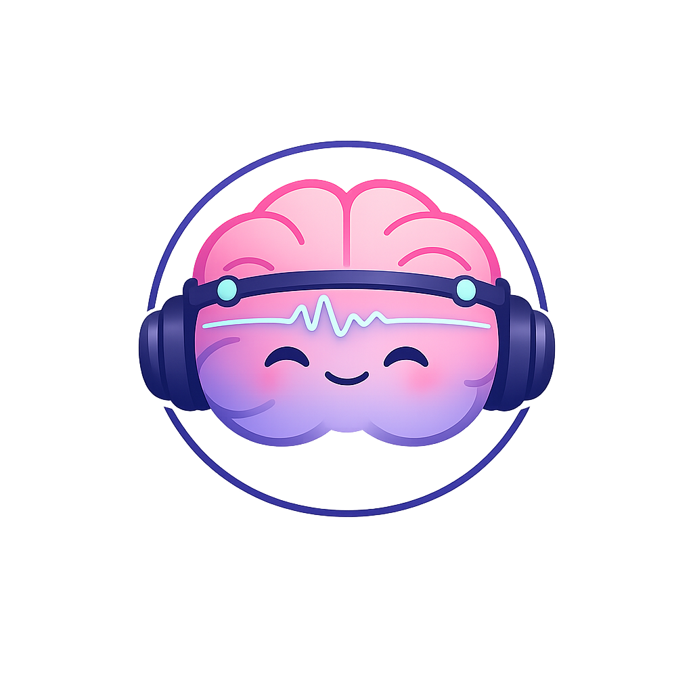
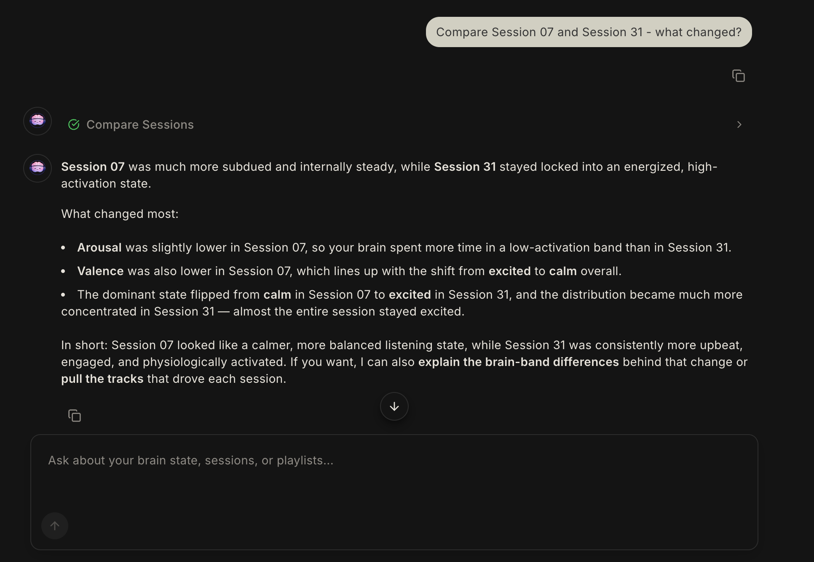
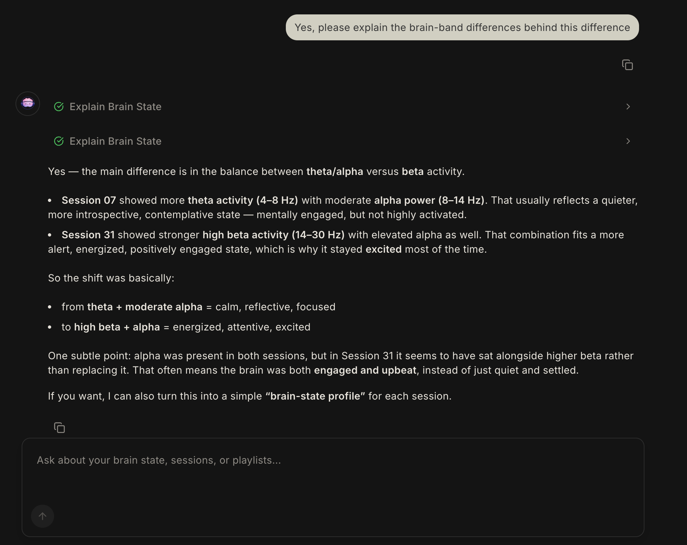

<div align="center">
  
  <h1>CortexDJ</h1>
  <p>An AI-powered EEG classifier that detects emotional states during music listening and curates Spotify playlists grounded in what your brain actually did.</p>

  [](https://github.com/LukeMainwaring/cortexdj/actions/workflows/ci.yml)
</div>

<div align="center">
  
</div>

## Why CortexDJ?

Music shapes your brain state, and your brain state shapes what music you want next. CortexDJ closes the loop: it classifies your EEG into emotion quadrants (relaxed / calm / excited / stressed) and curates Spotify playlists grounded in what your brain actually did while listening — not what you think you listened to, not what a recommender thinks people like you want.

## Features

- **Brain state classification** — Per-segment arousal/valence prediction mapped to four emotion quadrants (relaxed / calm / excited / stressed) for every 4-second EEG window
- **Dual model backends** — CBraMod pretrained transformer (4.9M params, raw EEG) or lightweight EEGNet (25K params, differential entropy features), selectable via env var and benchmarked leave-one-subject-out on 32-subject DEAP
- **Agentic orchestration** — A Pydantic AI agent decides which tools to call per query, enabling multi-step reasoning across session analysis, playlist curation, and track retrieval
- **Persistent brain context** — Dominant mood / arousal / valence attached to the conversation thread, surviving page refreshes and flowing dynamically into the system prompt
- **Contrastive EEG↔CLAP retrieval** — Joint 512-d embedding between raw EEG and LAION-CLAP audio, served via pgvector HNSW cosine search (proof-of-concept; see [Limitations](#limitations))
- **Emotion trajectory visualization** — Animated SVG path through Russell's affect space, plus a stacked band-power chart with delta / theta / alpha / beta / gamma activity
- **Brain-grounded playlist curation** — Queries historical EEG classifications to find tracks that consistently triggered a target mood, then builds a Spotify playlist with a user-confirmation gate
- **Inline tool transparency** — Every agent step renders an expandable tool-call panel with input parameters, output JSON, and a domain-specific visualization beneath

## Demo Workflows

These prompts showcase what CortexDJ can do that general-purpose chatbots can't. See [docs/DEMO_WORKFLOWS.md](docs/DEMO_WORKFLOWS.md) for the full catalog.

### Cross-session brain pattern comparison

> "Find me one session where I was calm and focused and one session where I was excited throughout"
>
> "Compare Session 07 and Session 31 — what changed?"
>
> "Yes, please explain the brain-band differences behind this difference"

<div align="center">
  
  &nbsp;&nbsp;
  
</div>

Side-by-side comparison of brain responses across two different listening sessions. Reveals how brain states differ across different music or different days.

### Brain-state track retrieval

> "Analyze Session 27"
>
> "Find me new songs that match how I was feeling during Session 27"

<div align="center">
  
</div>

Retrieving tracks from brain state embeds the session's EEG into the joint EEG↔CLAP space and returns top-k tracks ranked with cosine-similarity bars and inline 30-second iTunes previews for smoother, accurate music discovery.

## Why dual models + agent?

- **EEGNet** (custom dual-head): Compact CNN designed for EEG data, adapted with separate arousal and valence classification heads. Learns spatial and temporal EEG patterns from differential entropy features.
- **CBraMod** (pretrained dual-head): Transformer encoder pretrained on the TUEG corpus, fine-tuned with custom dual arousal/valence heads on DEAP. Flexible channel count via asymmetric conditional positional encoding — supports 32-channel DEAP and future 4-channel Muse 2 BCI.
- **Agent**: Orchestrates classification, analysis, and playlist curation. A query like _"build me a relaxation playlist"_ triggers brain state querying, track filtering by arousal/valence, and Spotify integration — multi-step reasoning that a static pipeline can't do.

## Quick Start

### Prerequisites

- [Docker](https://docs.docker.com/get-docker/) (for PostgreSQL)
- [uv](https://docs.astral.sh/uv/) (Python package manager)
- [pnpm](https://pnpm.io/) (Node package manager)
- [Node.js](https://nodejs.org/) 20+
- [GitHub CLI](https://cli.github.com/) (for checkpoint download)
- OpenAI API key

### Setup

```bash
# Clone and configure
git clone https://github.com/LukeMainwaring/cortexdj.git
cd cortexdj
cp .env.sample .env
# Edit .env with your OPENAI_API_KEY

# Start PostgreSQL + backend
docker compose up -d

# Backend setup
uv sync --directory backend
uv run --directory backend pre-commit install

# Download DEAP dataset (see backend/data/DEAP_SETUP.md)
# Place .dat files in backend/data/deap/

# Download pre-trained checkpoints (skips the 12 h training step; see DEVELOPMENT.md to retrain)
./backend/scripts/download-checkpoints.sh

# Seed the database
uv run --directory backend seed-sessions

# Frontend setup
pnpm -C frontend install
pnpm -C frontend generate-client
pnpm -C frontend dev

# Visit http://localhost:3003
```

## Tech Stack

| Layer | Technology |
|-------|-----------|
| Frontend | Next.js 16, Tailwind CSS, shadcn/ui, TanStack Query |
| Chat UI | Vercel AI SDK (`useChat`), Streamdown |
| Visualization | Recharts (timeline + band-power charts), motion/react (animated trajectory), Radix Tabs |
| Backend | FastAPI, Pydantic v2, async SQLAlchemy |
| Agent | Pydantic AI with OpenAI |
| ML | PyTorch (EEGNet), braindecode (CBraMod pretrained), MNE-Python, scipy |
| EEG Processing | Bandpass filtering, differential entropy, Welch PSD |
| Database | PostgreSQL + pgvector |
| Spotify | spotipy (OAuth 2.0) |
| DevOps | Docker Compose, GitHub Actions CI |
| Testing | pytest |
| Code Quality | Ruff, mypy (strict), pre-commit, Biome/Ultracite |

## Limitations

The EEG↔CLAP contrastive retrieval path described above is a deferred research direction — at DEAP scale, 4-second EEG windows do not carry enough track-specific signal to align with LAION-CLAP audio embeddings. See [Deferred research: EEG↔CLAP contrastive retrieval](docs/ROADMAP.md#deferred-research-eegclap-contrastive-retrieval) for the evaluation and the directions that would make it tractable.

## Development

See [DEVELOPMENT.md](DEVELOPMENT.md) for testing, linting, migrations, ML training workflows, and Modal GPU runs.

## Roadmap

See [docs/ROADMAP.md](docs/ROADMAP.md) for planned features including SEED/AMIGOS dataset support, live Muse 2 BCI integration, and personalized fine-tuning.
