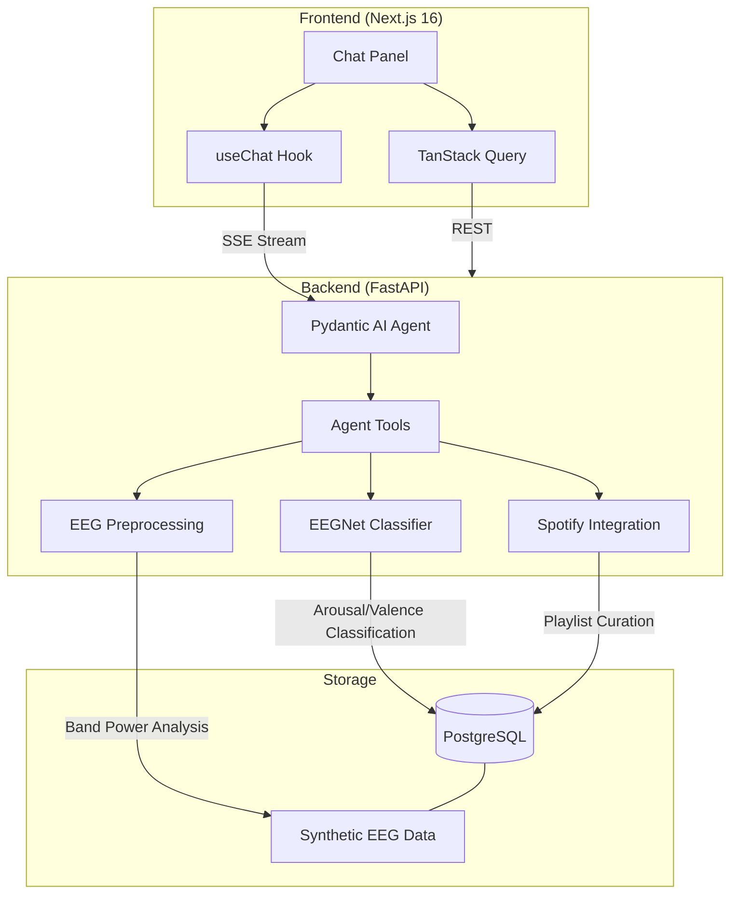

# CortexDJ

An AI-powered EEG brain-wave classifier that detects emotional states during music listening and curates Spotify playlists from brain-derived mood profiles. Combines a custom PyTorch neural network for EEG classification, MNE-Python for signal processing, and a Pydantic AI agent to orchestrate analysis and playlist curation.

## Architecture



### How It Works

1. **EEG data is preprocessed** using bandpass filtering and differential entropy feature extraction across 5 frequency bands (delta, theta, alpha, beta, gamma)
2. **EEGNet classifier** predicts arousal (low/high) and valence (low/high) for each 4-second EEG segment, mapping to four emotional quadrants: relaxed, calm, excited, stressed
3. **Pydantic AI agent** orchestrates session analysis, brain state explanation, and Spotify playlist curation through natural language conversation
4. **Session analysis** provides detailed brain state breakdowns with per-segment timelines, band power distributions, and associated track metadata
5. **Playlist builder** queries historical EEG data to find tracks that consistently triggered specific brain states, then assembles mood-matched playlists
6. **Agent streams responses** back as SSE in Vercel AI SDK format with transparent tool-call display

### Why EEGNet + Agent?

- **EEGNet** (custom dual-head): Compact CNN designed for EEG data, adapted with separate arousal and valence classification heads. Learns spatial and temporal EEG patterns from differential entropy features.
- **Agent**: Orchestrates classification, analysis, and playlist curation. A query like _"build me a relaxation playlist"_ triggers brain state querying, track filtering by arousal/valence, and Spotify integration — multi-step reasoning that a static pipeline can't do.

## Tech Stack

| Layer | Technology |
|-------|-----------|
| Frontend | Next.js 16, Tailwind CSS, shadcn/ui, TanStack Query |
| Chat UI | Vercel AI SDK (`useChat`), Streamdown |
| Backend | FastAPI, Pydantic v2, async SQLAlchemy |
| Agent | Pydantic AI with OpenAI |
| ML | PyTorch (EEGNet), MNE-Python, scipy |
| EEG Processing | Bandpass filtering, differential entropy, Welch PSD |
| Database | PostgreSQL |
| Spotify | spotipy (OAuth 2.0) |
| DevOps | Docker Compose, GitHub Actions CI |
| Code Quality | Ruff, mypy (strict), pre-commit, Biome/Ultracite |

## Project Structure

```
cortexdj/
├── backend/
│   ├── src/cortexdj/
│   │   ├── app.py                    # FastAPI app + lifespan (EEGNet loading)
│   │   ├── agents/
│   │   │   ├── brain_agent.py        # Pydantic AI agent + system prompt
│   │   │   ├── deps.py              # AgentDeps (db, eeg_model, spotify, brain_context)
│   │   │   ├── capabilities/        # Session, Insight, Playlist, Classification
│   │   │   └── tools/               # Tool implementations per capability
│   │   ├── ml/
│   │   │   ├── model.py             # EEGNet dual-head classifier (arousal + valence)
│   │   │   ├── dataset.py           # EEG emotion dataset (synthetic/DEAP)
│   │   │   ├── preprocessing.py     # Bandpass filtering, DE features, band powers
│   │   │   ├── train.py             # Training with 5-fold cross-validation
│   │   │   └── predict.py           # Inference wrapper
│   │   ├── models/                   # Session, EegSegment, Track, SessionTrack, Playlist, Thread, Message
│   │   ├── schemas/                  # Pydantic request/response schemas
│   │   ├── services/                 # eeg_processing, spotify, session, thread, title_generator
│   │   ├── routers/                  # agent (SSE), sessions, threads, health
│   │   ├── dependencies/            # db sessions
│   │   ├── migrations/              # Alembic
│   │   ├── scripts/                 # generate_synthetic, seed_sessions
│   │   └── core/config.py           # pydantic-settings
│   ├── data/
│   │   ├── synthetic/               # Generated EEG data (gitignored)
│   │   └── checkpoints/             # Model checkpoints (gitignored)
│   ├── Dockerfile                    # Multi-stage (uv builder -> app -> local)
│   └── pyproject.toml
├── frontend/                         # Next.js chat UI
│   ├── app/(chat)/                  # Chat page + API proxy route
│   ├── components/                  # chat, messages, greeting, brain-context-badge
│   └── api/                         # Generated client + hooks
├── docker-compose.yml               # PostgreSQL + backend
└── README.md
```

## Setup

### Prerequisites

- [Docker](https://docs.docker.com/get-docker/) (for PostgreSQL)
- [uv](https://docs.astral.sh/uv/) (Python package manager)
- [pnpm](https://pnpm.io/) (Node package manager)
- [Node.js](https://nodejs.org/) 20+
- OpenAI API key

### Quick Start

```bash
# Clone and configure
git clone https://github.com/LukeMainwaring/cortexdj.git
cd cortexdj
cp .env.sample .env
# Edit .env with your OPENAI_API_KEY

# Start PostgreSQL
docker compose up -d

# Backend setup
uv sync --directory backend
uv run --directory backend pre-commit install

# Generate synthetic EEG data
uv run --directory backend generate-synthetic

# Train the EEGNet model
uv run --directory backend train-model

# Seed the database
uv run --directory backend seed-sessions

# Frontend setup
pnpm -C frontend install
pnpm -C frontend generate-client

# Run
# Terminal 1: docker compose up -d (if not already running)
# Terminal 2: pnpm -C frontend dev
# Visit http://localhost:3003
```

## EEG Pipeline

```
EEG Signal (32 channels @ 128 Hz)
    |
    ├── Bandpass Filter ──→ 5 frequency bands (delta/theta/alpha/beta/gamma)
    |
    ├── Differential Entropy ──→ 160-dim feature vector (32 channels x 5 bands)
    |
    └── EEGNet Classifier ──→ Dual-head predictions
                                ├── Arousal (low/high)
                                └── Valence (low/high)
                                        |
                                        └── Emotion Quadrant
                                            ├── Relaxed (low arousal, high valence)
                                            ├── Calm (low arousal, low valence)
                                            ├── Excited (high arousal, high valence)
                                            └── Stressed (high arousal, low valence)
```

## Design Decisions

- **Synthetic data for MVP.** Realistic EEG-like signals with controlled band power profiles. Real dataset support (DEAP, SEED) documented in [Roadmap](docs/ROADMAP.md).
- **No pgvector.** EEG segments queried by arousal/valence scores using standard SQL — no embedding similarity search needed.
- **Spotify is optional.** Playlist capabilities gracefully hidden via `prepare_tools` when Spotify credentials aren't configured.
- **EEGNet architecture.** Custom dual-head PyTorch model with spatial and temporal convolutions — designed for EEG, not a generic CNN.
- **Thread-backed brain context.** Persistent per-thread JSONB column storing dominant mood, arousal, valence — survives page refreshes.
- **Agentic orchestration.** The agent decides which tools to call per query, enabling multi-step reasoning (analyze session -> explain brain state -> build playlist).
