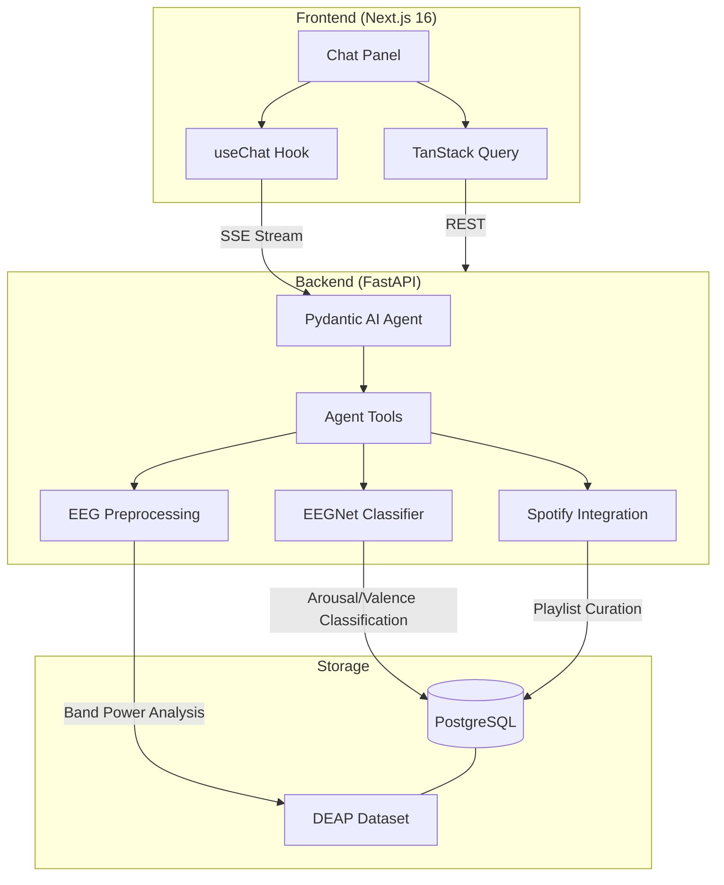

# CortexDJ

An AI-powered EEG brain-wave classifier that detects emotional states during music listening and curates Spotify playlists from brain-derived mood profiles. Combines a custom PyTorch neural network for EEG classification, MNE-Python for signal processing, and a Pydantic AI agent to orchestrate analysis and playlist curation.

## Architecture



### How It Works

1. **EEG data is preprocessed** using bandpass filtering and differential entropy feature extraction across 5 frequency bands (delta, theta, alpha, beta, gamma)
2. **Dual model backends** classify arousal (low/high) and valence (low/high) for each 4-second EEG segment, mapping to four emotional quadrants: relaxed, calm, excited, stressed
   - **EEGNet** (custom, 25K params): operates on hand-crafted DE features — fast, lightweight
   - **CBraMod** (pretrained, 4.9M params): operates on raw EEG via pretrained transformer encoder fine-tuned on DEAP — higher accuracy
3. **DEAP dataset** provides real EEG benchmark data (32 participants, 40 music video trials) evaluated with leave-one-subject-out cross-validation. Labels are binarized at each subject's own Likert median by default (`median_per_subject`) to produce balanced classes; class-weighted cross-entropy plus label smoothing are applied per fold. Reported headline metric is **macro-F1** against a `MajorityBaseline` reference row, not raw accuracy.
4. **Pydantic AI agent** orchestrates session analysis, brain state explanation, and Spotify playlist curation through natural language conversation
5. **Session analysis** provides detailed brain state breakdowns with per-segment timelines, band power distributions, and associated track metadata
6. **Inline EEG visualization** — when the agent calls `analyze_session`, the chat UI renders a tabbed `SessionVisualization` beneath the tool call: a **Trajectory** view plots the session as an animated 2D path through Russell's arousal/valence affect space (smoothed with rolling mean, raw 4-second points overlaid, playback controls), a **Timeline** view shows arousal/valence over time, and a stacked frequency-band-power chart sits below both. The backend computes a `trajectory_summary` (dwell per quadrant, transitions, centroid, dispersion, path length) which the agent is instructed to cite when narrating the emotional arc
7. **Playlist builder** queries historical EEG data to find tracks that consistently triggered specific brain states, then assembles mood-matched playlists (with user confirmation before creating)
8. **EEG↔CLAP contrastive retrieval** — a second `EegCLAPEncoder` (CBraMod backbone + SimCLR-style projection head) learns a joint 512-d embedding space between raw EEG windows and LAION-CLAP audio embeddings via symmetric soft-target InfoNCE. At query time, the agent's `retrieve_tracks_from_brain_state` tool embeds a full session, cosine-searches a pgvector HNSW index of pre-computed track CLAP embeddings, and returns the top-k nearest Spotify tracks. Unlike the quadrant-filter playlist tools, this reaches into a pre-built audio pool that may include tracks the user has never listened to — "find songs that sound like how I was feeling" rather than "curate from history"
9. **Spotify integration** provides search, library access, and playlist management tools — user-authenticated tools are hidden when Spotify is not connected. Audio previews for the retrieval index come from the **iTunes Search API** (Spotify deprecated `preview_url` for standard-mode apps in Nov 2024); Spotify stays the source of truth for track identity and playlist mutation
10. **Inline retrieval visualization** — when the agent calls `retrieve_tracks_from_brain_state`, the chat UI renders a `<RetrievedTracksPanel>` beneath the tool call with ranked tracks, similarity bars, inline 30s preview playback, and Spotify deep-links
11. **Agent streams responses** back as SSE in Vercel AI SDK format with transparent tool-call display; a history processor summarizes large tool results from prior turns to prevent token bloat

### Why Dual Models + Agent?

- **EEGNet** (custom dual-head): Compact CNN designed for EEG data, adapted with separate arousal and valence classification heads. Learns spatial and temporal EEG patterns from differential entropy features.
- **CBraMod** (pretrained dual-head): Transformer encoder pretrained on the TUEG corpus, fine-tuned with custom dual arousal/valence heads on DEAP. Flexible channel count via asymmetric conditional positional encoding — supports 32-channel DEAP and future 4-channel Muse 2 BCI.
- **Agent**: Orchestrates classification, analysis, and playlist curation. A query like _"build me a relaxation playlist"_ triggers brain state querying, track filtering by arousal/valence, and Spotify integration — multi-step reasoning that a static pipeline can't do.

## Tech Stack

| Layer | Technology |
|-------|-----------|
| Frontend | Next.js 16, Tailwind CSS, shadcn/ui, TanStack Query |
| Chat UI | Vercel AI SDK (`useChat`), Streamdown |
| Visualization | Recharts (timeline + band-power charts), motion/react (animated trajectory), Radix Tabs |
| Backend | FastAPI, Pydantic v2, async SQLAlchemy |
| Agent | Pydantic AI with OpenAI |
| ML | PyTorch (EEGNet), braindecode (CBraMod pretrained), MNE-Python, scipy |
| EEG Processing | Bandpass filtering, differential entropy, Welch PSD |
| Database | PostgreSQL |
| Spotify | spotipy (OAuth 2.0) |
| DevOps | Docker Compose, GitHub Actions CI |
| Testing | pytest |
| Code Quality | Ruff, mypy (strict), pre-commit, Biome/Ultracite |

## Project Structure

```
cortexdj/
├── backend/
│   ├── src/cortexdj/
│   │   ├── app.py                    # FastAPI app + lifespan (EEGNet loading)
│   │   ├── agents/
│   │   │   ├── brain_agent.py        # Pydantic AI agent + system prompt
│   │   │   ├── deps.py              # AgentDeps (db, eeg_model, spotify, brain_context)
│   │   │   ├── capabilities/        # Session, Insight, Playlist, Classification
│   │   │   ├── tools/               # Tool implementations per capability
│   │   │   └── history_processor.py # Summarizes large tool results to prevent token bloat
│   │   ├── ml/
│   │   │   ├── model.py             # EEGNet dual-head classifier (arousal + valence)
│   │   │   ├── dataset.py           # DEAP EEG datasets (feature/raw modes)
│   │   │   ├── preprocessing.py     # Bandpass filtering, DE features, band powers
│   │   │   ├── pretrained.py        # CBraMod pretrained dual-head wrapper
│   │   │   ├── train.py             # Training with LOSO/grouped CV, model comparison
│   │   │   ├── predict.py           # Inference wrapper (EEGNet + CBraMod)
│   │   │   ├── contrastive.py       # EegCLAPEncoder + ClapAudioEncoder + symmetric_info_nce loss
│   │   │   ├── contrastive_dataset.py  # DeapClapPairDataset + build_audio_embedding_cache
│   │   │   └── contrastive_train.py    # Contrastive training w/ TensorBoard + embedding projector
│   │   ├── models/                   # Session, EegSegment, Track, SessionTrack, Playlist, Thread, Message, TrackAudioEmbedding
│   │   ├── schemas/                  # Pydantic request/response schemas
│   │   ├── services/                 # eeg_processing, spotify, session, thread, title_generator, trajectory, retrieval, audio_catalog
│   │   ├── routers/                  # agent (SSE), sessions, threads, health, retrieval
│   │   ├── dependencies/            # FastAPI DI (db sessions, EEG model)
│   │   ├── migrations/              # Alembic
│   │   ├── scripts/                 # seed_sessions
│   │   └── core/config.py           # pydantic-settings
│   ├── tests/                        # pytest (preprocessing, dataset, ML)
│   ├── data/
│   │   ├── deap/                    # DEAP dataset .dat files (gitignored, see DEAP_SETUP.md)
│   │   └── checkpoints/             # Model checkpoints (gitignored)
│   ├── Dockerfile                    # Multi-stage (uv builder -> app -> local)
│   └── pyproject.toml
├── frontend/                         # Next.js chat UI
│   ├── app/(chat)/                  # Chat page + API proxy route
│   ├── components/                  # chat, messages, greeting, brain-context-badge, session-visualization, emotion-trajectory
│   └── api/                         # Generated client + hooks
├── docker-compose.yml               # PostgreSQL + backend
└── README.md
```

## Setup

### Prerequisites

- [Docker](https://docs.docker.com/get-docker/) (for PostgreSQL)
- [uv](https://docs.astral.sh/uv/) (Python package manager)
- [pnpm](https://pnpm.io/) (Node package manager)
- [Node.js](https://nodejs.org/) 20+
- OpenAI API key

### Quick Start

```bash
# Clone and configure
git clone https://github.com/LukeMainwaring/cortexdj.git
cd cortexdj
cp .env.sample .env
# Edit .env with your OPENAI_API_KEY

# Start PostgreSQL
docker compose up -d

# Backend setup
uv sync --directory backend
uv run --directory backend pre-commit install

# Download DEAP dataset (see backend/data/DEAP_SETUP.md)
# Place .dat files in backend/data/deap/

# Train the model (CBraMod with LOSO CV by default)
uv run --directory backend train-model

# Seed the database
uv run --directory backend seed-sessions

# Frontend setup
pnpm -C frontend install
pnpm -C frontend generate-client

# Run
# Terminal 1: docker compose up -d (if not already running)
# Terminal 2: pnpm -C frontend dev
# Visit http://localhost:3003
```

## EEG Pipeline

Two model backends are supported — selectable via `EEG_MODEL_BACKEND` env var:

```
Pipeline A: Custom EEGNet (default)
  EEG Signal (32 channels @ 128 Hz)
      ├── Bandpass Filter ──→ 5 frequency bands
      ├── Differential Entropy ──→ 160-dim feature vector
      └── EEGNet Classifier ──→ Dual-head predictions

Pipeline B: CBraMod Pretrained (fine-tuned)
  EEG Signal (32 channels @ 128 Hz)
      ├── Resample ──→ 200 Hz (CBraMod target)
      └── CBraMod Encoder + Dual Heads ──→ Predictions

Both produce:
  ├── Arousal (low/high)
  └── Valence (low/high)
          └── Emotion Quadrant
              ├── Relaxed (low arousal, high valence)
              ├── Calm (low arousal, low valence)
              ├── Excited (high arousal, high valence)
              └── Stressed (high arousal, low valence)
```

## Design Decisions

- **Dual model backends.** Custom EEGNet on hand-crafted DE features for lightweight inference; CBraMod pretrained encoder (fine-tuned on DEAP) for higher accuracy. Both produce identical `EEGPredictionResult` outputs. Configurable via `EEG_MODEL_BACKEND`.
- **DEAP dataset support.** Real EEG benchmark (32 participants, music + emotion labels). LOSO cross-validation for rigorous evaluation.
- **Robust training loop.** The training loop (`ml/train.py`) binarizes DEAP's 1–9 Likert self-reports at each subject's own median by default (`--label-split median_per_subject`), computes per-fold per-head class weights via `ml/metrics.py`, applies label smoothing, and early-stops on EMA-smoothed macro-F1 with a minimum-epochs floor. `compare-models` always renders a `MajorityBaseline` reference row so majority-class predictions are immediately visible.
- **DEAP-only training pipeline.** All training and seeding uses the DEAP dataset (freely available via Kaggle). Synthetic data generators will return for Muse 2 BCI development (4 channels, 256Hz, different montage) when Phase 3 begins.
- **Contrastive retrieval via pgvector HNSW.** The `track_audio_embeddings` table stores 512-d LAION-CLAP audio embeddings with an HNSW cosine index (`m=16, ef_construction=64`). HNSW over IVFFlat because IVFFlat requires training on existing rows and would be built on an empty table in the same migration, forcing a reindex after every seed pass; HNSW handles incremental inserts natively and has better recall at the project's 2k–10k row scale. The quadrant-filter tools still use plain SQL on the `eeg_segments` table — pgvector is purely for the new contrastive retrieval path, not for the existing arousal/valence filters.
- **iTunes as audio source.** Spotify deprecated `preview_url` for standard-mode apps on 2024-11-27 (empirically verified 0/10 hits against this project's 2018 app). The audio catalog (`services/audio_catalog.py`) cross-references Spotify identity to iTunes Search for the actual 30s m4a preview bytes using a precision-first match heuristic: reject any result with `|duration_delta| > 3s`, rank survivors by artist-name Jaccard. Empirically validated at ~86% hit rate on 50 real saved tracks. Misses go to a log file; no retry loops.
- **Spotify is optional.** User-authenticated tools (library, playlist management) hidden via `prepare_tools` when not connected; public tools (search, track info) always available. Mutation tools require explicit user confirmation (`user_confirmed=True`) to prevent accidental writes.
- **EEGNet architecture.** Custom dual-head PyTorch model with spatial and temporal convolutions — designed for EEG, not a generic CNN.
- **Thread-backed brain context.** Persistent per-thread JSONB column storing dominant mood, arousal, valence — survives page refreshes. Dynamically injected into the agent system prompt via `get_instructions()` so the agent is immediately context-aware.
- **History processor.** Large tool results (track lists, playlists) are automatically summarized in prior conversation turns, keeping the current turn's data intact while preventing token bloat in multi-turn sessions.
- **Inline tool visualization.** The chat message renderer detects `analyze_session` tool calls and renders a `<SessionVisualization>` component directly beneath the existing tool-call collapsible. It wraps a **Trajectory** view (custom SVG + `motion/react` with animated `pathLength`, quadrant backgrounds, playback scrubber) and a **Timeline** view (recharts) in Radix Tabs, with the band-power chart shared below both. The component fetches `/api/sessions/{id}/segments` via a wrapped TanStack Query hook (`useSessionSegments`) so the agent's tool output stays unchanged and decoupled from the UI.
- **Trajectory summary in the agent context.** The `trajectory_summary` (dwell per quadrant, transitions, centroid, dispersion, path length) is computed on read in `services/trajectory.py` and embedded in `analyze_session`'s tool output. The dense `smoothed` per-segment trail is stripped from the tool payload (the frontend fetches it separately via the segments route) to avoid bloating the agent context. `SessionCapability.get_instructions` tells the agent to narrate the emotional arc using these fields instead of citing only the single dominant state.
- **Agentic orchestration.** The agent decides which tools to call per query, enabling multi-step reasoning (analyze session -> explain brain state -> build playlist).
