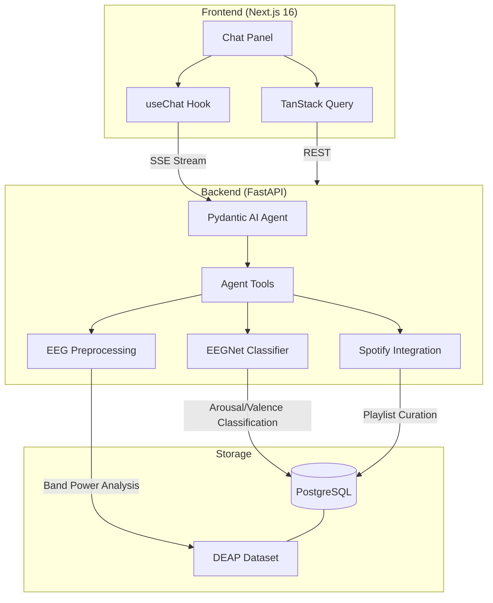

# CortexDJ

An AI-powered EEG brain-wave classifier that detects emotional states during music listening and curates Spotify playlists from brain-derived mood profiles. Combines a custom PyTorch neural network for EEG classification, MNE-Python for signal processing, and a Pydantic AI agent to orchestrate analysis and playlist curation.

## Architecture



### How It Works

1. **EEG data is preprocessed** using bandpass filtering and differential entropy feature extraction across 5 frequency bands (delta, theta, alpha, beta, gamma)
2. **Dual model backends** classify arousal (low/high) and valence (low/high) for each 4-second EEG segment, mapping to four emotional quadrants: relaxed, calm, excited, stressed
   - **EEGNet** (custom, 25K params): operates on hand-crafted DE features — fast, lightweight
   - **CBraMod** (pretrained, 4.9M params): operates on raw EEG via pretrained transformer encoder fine-tuned on DEAP — higher accuracy
3. **DEAP dataset** provides real EEG benchmark data (32 participants, 40 music video trials) evaluated with leave-one-subject-out cross-validation. Labels are binarized at each subject's own Likert median by default (`median_per_subject`) to produce balanced classes; class-weighted cross-entropy plus label smoothing are applied per fold. Reported headline metric is **macro-F1** against a `MajorityBaseline` reference row, not raw accuracy.
4. **Pydantic AI agent** orchestrates session analysis, brain state explanation, Spotify playlist curation, and contrastive track retrieval through natural language conversation
5. **Session analysis** provides detailed brain state breakdowns with per-segment timelines, band power distributions, and associated track metadata
6. **Playlist builder** queries historical EEG data to find tracks that consistently triggered specific brain states, then assembles mood-matched playlists (with user confirmation before creating)
7. **EEG↔CLAP contrastive retrieval** (research direction — see Limitations) — `EegCLAPEncoder` (CBraMod backbone + SimCLR projection head) learns a joint 512-d embedding between raw EEG windows and LAION-CLAP audio via symmetric soft-target InfoNCE. At query time, `retrieve_tracks_from_brain_state` embeds a session and runs a pgvector HNSW cosine search against a pre-computed track index, returning top-k Spotify tracks — including ones the user has never heard. Distinct from the quadrant-filter playlist tools, which curate from already-labeled EEG data
8. **Spotify integration** provides search, library access, and playlist management tools — user-authenticated tools are hidden when Spotify is not connected. Audio previews for the retrieval index come from the **iTunes Search API** (Spotify deprecated `preview_url` for standard-mode apps in Nov 2024); Spotify stays the source of truth for track identity and playlist mutation
9. **Inline tool visualization** — the chat UI auto-renders SVG trajectory + timeline panels beneath `analyze_session` calls, and ranked-track cards with inline 30s previews beneath retrieval calls
10. **Agent streams responses** back as SSE in Vercel AI SDK format with transparent tool-call display; a history processor summarizes large tool results from prior turns to prevent token bloat

### Why Dual Models + Agent?

- **EEGNet** (custom dual-head): Compact CNN designed for EEG data, adapted with separate arousal and valence classification heads. Learns spatial and temporal EEG patterns from differential entropy features.
- **CBraMod** (pretrained dual-head): Transformer encoder pretrained on the TUEG corpus, fine-tuned with custom dual arousal/valence heads on DEAP. Flexible channel count via asymmetric conditional positional encoding — supports 32-channel DEAP and future 4-channel Muse 2 BCI.
- **Agent**: Orchestrates classification, analysis, and playlist curation. A query like _"build me a relaxation playlist"_ triggers brain state querying, track filtering by arousal/valence, and Spotify integration — multi-step reasoning that a static pipeline can't do.

## Tech Stack

| Layer | Technology |
|-------|-----------|
| Frontend | Next.js 16, Tailwind CSS, shadcn/ui, TanStack Query |
| Chat UI | Vercel AI SDK (`useChat`), Streamdown |
| Visualization | Recharts (timeline + band-power charts), motion/react (animated trajectory), Radix Tabs |
| Backend | FastAPI, Pydantic v2, async SQLAlchemy |
| Agent | Pydantic AI with OpenAI |
| ML | PyTorch (EEGNet), braindecode (CBraMod pretrained), MNE-Python, scipy |
| EEG Processing | Bandpass filtering, differential entropy, Welch PSD |
| Database | PostgreSQL |
| Spotify | spotipy (OAuth 2.0) |
| DevOps | Docker Compose, GitHub Actions CI |
| Testing | pytest |
| Code Quality | Ruff, mypy (strict), pre-commit, Biome/Ultracite |

## Project Structure

Standard monorepo — `backend/` (FastAPI + ML pipelines under `src/cortexdj/`), `frontend/` (Next.js App Router), `docker-compose.yml` for Postgres. See `CLAUDE.md` for a directory-level architecture map.

## Setup

### Prerequisites

- [Docker](https://docs.docker.com/get-docker/) (for PostgreSQL)
- [uv](https://docs.astral.sh/uv/) (Python package manager)
- [pnpm](https://pnpm.io/) (Node package manager)
- [Node.js](https://nodejs.org/) 20+
- OpenAI API key

### Quick Start

```bash
# Clone and configure
git clone https://github.com/LukeMainwaring/cortexdj.git
cd cortexdj
cp .env.sample .env
# Edit .env with your OPENAI_API_KEY

# Start PostgreSQL
docker compose up -d

# Backend setup
uv sync --directory backend
uv run --directory backend pre-commit install

# Download DEAP dataset (see backend/data/DEAP_SETUP.md)
# Place .dat files in backend/data/deap/

# Train the model (CBraMod with LOSO CV by default)
uv run --directory backend train-model

# Seed the database
uv run --directory backend seed-sessions

# Frontend setup
pnpm -C frontend install
pnpm -C frontend generate-client

# Run
# Terminal 1: docker compose up -d (if not already running)
# Terminal 2: pnpm -C frontend dev
# Visit http://localhost:3003
```

## EEG Pipeline

Two model backends are supported — selectable via `EEG_MODEL_BACKEND` env var:

```
Pipeline A: Custom EEGNet (default)
  EEG Signal (32 channels @ 128 Hz)
      ├── Bandpass Filter ──→ 5 frequency bands
      ├── Differential Entropy ──→ 160-dim feature vector
      └── EEGNet Classifier ──→ Dual-head predictions

Pipeline B: CBraMod Pretrained (fine-tuned)
  EEG Signal (32 channels @ 128 Hz)
      ├── Resample ──→ 200 Hz (CBraMod target)
      └── CBraMod Encoder + Dual Heads ──→ Predictions

Both produce:
  ├── Arousal (low/high)
  └── Valence (low/high)
          └── Emotion Quadrant
              ├── Relaxed (low arousal, high valence)
              ├── Calm (low arousal, low valence)
              ├── Excited (high arousal, high valence)
              └── Stressed (high arousal, low valence)
```

## Design Decisions

- **Dual model backends.** Custom EEGNet on hand-crafted DE features for lightweight inference; CBraMod pretrained encoder (fine-tuned on DEAP) for higher accuracy. Both produce identical `EEGPredictionResult` outputs and evaluate via LOSO cross-validation on the DEAP benchmark (32 participants, music + emotion labels). Configurable via `EEG_MODEL_BACKEND`.
- **Robust training loop.** DEAP's 1–9 Likert self-reports are binarized at each subject's own median by default, with class-weighted loss and label smoothing to handle residual imbalance. Headline metric is macro-F1 against a `MajorityBaseline` reference row, not raw accuracy.
- **Contrastive retrieval via pgvector HNSW** (research direction — see Limitations). `track_audio_embeddings` stores 512-d LAION-CLAP vectors with an HNSW cosine index; HNSW over IVFFlat because it handles incremental inserts natively and doesn't require retraining on each seed pass.
- **iTunes as audio source.** Spotify deprecated `preview_url` for standard-mode apps on 2024-11-27 (empirically verified 0/10 hits against this project's 2018 app). `services/audio_catalog.py` cross-references Spotify identity to the iTunes Search API for the actual 30s m4a preview bytes.
- **Spotify is optional.** User-authenticated tools (library, playlist management) hidden via `prepare_tools` when not connected; public tools (search, track info) always available. Mutation tools require explicit user confirmation to prevent accidental writes.
- **Thread-backed brain context.** Persistent per-thread JSONB column storing dominant mood, arousal, valence — survives page refreshes. Dynamically injected into the agent system prompt via `get_instructions()` so the agent is immediately context-aware.
- **Inline tool visualization.** Chat UI auto-renders visualization panels beneath tool calls that return structured data. The backend computes a `trajectory_summary` (dwell per quadrant, transitions, centroid, dispersion, path length) that feeds both the SVG trajectory chart and the agent narration via `SessionCapability.get_instructions`.

## Limitations

The EEG↔CLAP contrastive retrieval path described above is a deferred research direction, not a shipped capability — at DEAP scale, 4-second EEG windows do not carry enough track-specific signal to align with LAION-CLAP audio embeddings. The quadrant classification pipeline and quadrant-filtered playlist curation are working as described. See [Deferred research: EEG↔CLAP contrastive retrieval](docs/ROADMAP.md#deferred-research-eegclap-contrastive-retrieval) for evidence and forward direction.
